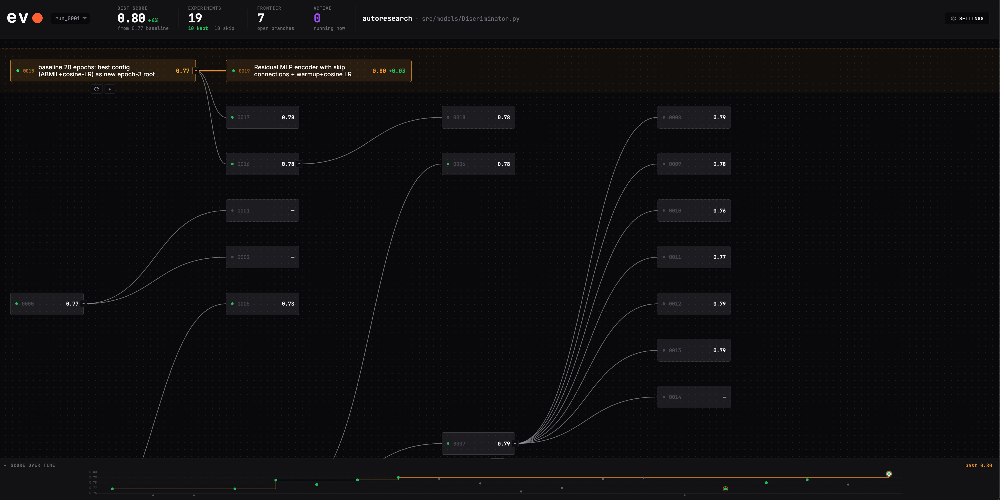

# autoresearch — automated ML optimisation for digital pathology classifiers

An autonomous experiment loop that iteratively improves a whole-slide image (WSI) classifier using the [evo](https://github.com/evo-hq/evo) optimisation framework and Claude Code as the agent backend.

<p align="center">
  
</p>

# Model Development

All experiments that improved upon the baseline (0.768 macro AUROC), most recent first:

| Exp | AUROC | Δ | What changed |
|---|---|---|---|
| exp_0044 | **0.852** | +0.020 | Sharper ABMIL attention (temperature T=0.5 in softmax) concentrates weight on fewer, more discriminative patches |
| exp_0025 | 0.823 | +0.014 | Two-block deep ResidualMLP encoder (2560→1280→512) with two skip connections deepens the patch-embedding projection |
| exp_0020 | 0.809 | +0.013 | Gated ABMIL aggregator stacked on the residual encoder replaces additive MIL pooling |
| exp_0019 | 0.796 | +0.027 | Residual MLP encoder with skip connection combined with warmup+cosine LR schedule |
| exp_0017 | 0.785 | +0.017 | ABMIL gated attention aggregator + warmup+cosine LR schedule on the 20-epoch baseline |
| exp_0016 | 0.779 | +0.011 | Transformer aggregator with 2D RoPE spatial encoding (dead-end branch, later superseded by ABMIL) |
| exp_0004 | 0.784 | +0.016 | Warmup + cosine annealing LR schedule replacing the fixed learning rate |

## What it does

The system runs a hill-climbing optimisation loop over a MIL (Multiple Instance Learning) model for WSI classification. In each round, AI subagents propose and evaluate architectural or training changes — LR schedules, aggregation strategies, loss functions, encoder design — and the best-scoring variants are kept. The loop runs autonomously until a target metric is reached or the stall limit is hit.

```
Orchestrator
  ├── reads experiment tree, patterns, frontier
  ├── writes structured briefs (non-overlapping objectives)
  └── spawns N parallel subagents
        each subagent:
          ├── creates an evo experiment (git worktree)
          ├── edits code in the worktree
          ├── runs the benchmark (~10 epochs on GPU)
          └── commits or discards based on score delta
```

## Model

**MammothMIL** — a Mixture-of-Experts MIL architecture for patch-level feature aggregation:

- **Encoder**: MLP compressing foundation-model patch embeddings (Virchow2, 2560-dim) to a lower-dimensional projection
- **Aggregator**: class-conditional additive MIL (baseline) or gated-attention ABMIL
- **Classifier**: linear head over the bag-level representation
- **Training**: AdamW + optional warmup/cosine LR schedule, CrossEntropyLoss, Lightning

Input features are pre-extracted hierarchical Virchow2 embeddings (256×256 patches at 20×). One WSI = one bag of N patches.

## Optimisation setup

| Parameter | Value |
|---|---|
| Metric | macro AUROC (val set) |
| Proxy epochs | 10 (fast iteration) |
| Noise floor | 0.01 AUROC (discard smaller deltas) |
| Subagents / round | 2 |
| Stall limit | 4 consecutive rounds with no improvement |

## Repository layout

```
autoresearch/
├── src/
│   ├── models/
│   │   ├── Discriminator.py      # MammothNet + aggregators (main edit target)
│   │   ├── experts_MIL.py        # ClassConditionalAdditiveMIL
│   │   ├── attention.py          # GatedAttn module
│   │   └── modules.py            # MLP building block
│   ├── training/
│   │   ├── trainer.py            # MammothTrainer Lightning module (main edit target)
│   │   └── losses.py             # FocalLoss, FocalTverskyLoss
│   └── utils/
│       └── implementations.py   # experimental scratchpad
├── scripts/
│   └── train_discriminatorMIL.py # manual training entry point (reference only)
├── evaluate.py                   # evo benchmark script — do not modify
├── gate.sh                       # evo gate (import + forward-pass checks) — do not modify
├── evo_setup.sh                  # one-shot workspace initialisation
├── EXPERIMENTS.md                # living experiment log
├── CLAUDE.md                     # operational notes for the agent
└── .evo/
    ├── meta.json                 # workspace state
    └── project.md                # agent optimisation scope & guidance
```

## Getting started

### Prerequisites

- Python 3.12+, `git`, [`uv`](https://github.com/astral-sh/uv), `conda`/`mamba`
- GPU with CUDA (recommended: A100 or H100)
- Claude Code with the evo plugin:
  ```bash
  /plugin marketplace add evo-hq/evo
  /plugin install evo@evo-hq-evo
  ```
- Pre-extracted patch features and a fold CSV (see `evo_setup.sh`)

### Initialise the workspace

Edit the paths at the top of `evo_setup.sh`, then:

```bash
bash evo_setup.sh
```

This initialises the evo workspace, writes the benchmark environment, and sets the conda runtime prefix.

### Run the baseline

```bash
evo run exp_0001 --timeout 7200
```

Wait for it to commit before starting the optimisation loop.

### Start optimising

From Claude Code:

```
/evo:optimize subagents=2 budget=5 stall=4
```

Each round, two experiments train in parallel (~40–55 min each on GPU). Results are committed automatically; the orchestrator picks up where each round left off.

### Monitor

```bash
evo status          # one-line summary
evo scratchpad      # full tree + frontier + what-not-to-try
evo dashboard       # browser UI (default port 8080)
```

Dashboard requires an SSH tunnel if running on a remote server:
```bash
ssh -L 8080:localhost:8080 <your-server>
# then open http://localhost:8080
```

## Key operational notes

See [CLAUDE.md](CLAUDE.md) for the full list. Critical points:

- **Always pass `--timeout 7200`** to `evo run` — default 30-min timeout is shorter than one training run.
- **After any workspace reset**, re-apply the runtime prefix:
  ```bash
  evo config runtime set --prefix "conda run -p /path/to/conda_env"
  ```
- **Benchmark stdout must be clean JSON** — redirect training logs to stderr:
  ```bash
  python evaluate.py ... >&2 && cat .evo_result.json
  ```
- **Never stack `evo run` processes** — check `ps aux | grep "evo run"` before launching.

## Files agents may edit

- `src/models/Discriminator.py` — MoE architecture, aggregators
- `src/training/trainer.py` — Lightning trainer, loss, optimiser, LR schedule
- `src/utils/implementations.py` — scratchpad for experimental code

Files **out of scope** (do not modify): `data/dataset.py`, `evaluate.py`, `gate.sh`, `tests/`.
